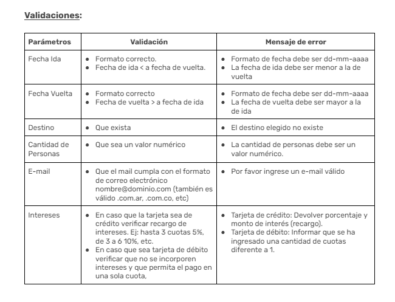

### Sistema de procesamiento de Vuelos y Hoteles

---

*Equipo de Desarrollo:*
- Franco Lazzaroni
- Alejandro Seravalle
- Manuel Efrain Muract Correa
- Jorgelina Finello
- Rocío Martínez

*Tecnologías Utilizadas:*
- Java
- Spring Boot
- Lombok
- Spring Web
- Spring Dev Tools
- IntelliJ IDEA
- Postman
- Spring boot starter test
- Jakarta
- Hibernate

---
### Descripción

Este proyecto proporciona una plataforma para la gestión de reservas de hoteles y vuelos. Utilizando este sistema, los usuarios pueden realizar las siguientes acciones:

- Obtener un listado de todos los hoteles registrados.
- Buscar hoteles disponibles en un determinado rango de fechas y destino.
- Realizar reservas de hoteles, especificando la fecha de entrada, fecha de salida, cantidad de personas y tipo de habitación.
- Obtener el monto total de una reserva de hotel, incluyendo el interés aplicado en caso de pagar con tarjeta de crédito.

Además, los usuarios también pueden:

- Obtener un listado de todos los vuelos registrados.
- Buscar vuelos disponibles en un determinado rango de fechas, origen y destino.
- Realizar reservas de vuelos, especificando la fecha de ida, cantidad de personas y tipo de asiento.
- Obtener el monto total de una reserva de vuelo, incluyendo el interés aplicado en caso de pagar con tarjeta de crédito.

Este sistema ofrece una solución completa para la planificación y gestión de viajes, facilitando la reserva de alojamiento y transporte de manera eficiente y conveniente.
### Requerimientos del Sistema

#### 1. Hoteles

*US 0001:* Obtener un listado de todos los hoteles registrados

*Endpoint:*

GET /api/v1/hotels


*US 0002:* Obtener un listado de todos los hoteles disponibles en un determinado rango de fechas y según el destino seleccionado.

*Endpoint:*

GET /api/v1/hotels?date_from=dd/mm/aaaa&date_to=dd/mm/aaaa&destination=Puerto Iguazú


*Filtros:*
- Fecha Entrada (dd/mm/aaaa)
- Fecha Salida (dd/mm/aaaa)
- Destino (String
-
- Excepciones: Si los datos no coinciden se va a recibir una excepción, "No se encontraron hoteles para la fecha solicitada", 404".

*US 0003:* Realizar una reserva de un hotel, indicando cantidad de personas, fecha de entrada, fecha de salida y tipo de habitación. Obtener como respuesta el monto total de la reserva realizada.

*Endpoint:*

### POST /api/v1/booking


*Respuesta:*
```json
{
"user_name": "juanperez@gmail.com",
"amount": 3000.50,
"interest": 5.5,
"total": 3165.52,
"booking": {
"date_from": "10-11-2025",
"date_to": "20-11-2025",
"destination": "Puerto Iguazú",
"hotel_code": "CC-00002",
"people_amount": 2,
"room_type": "DOUBLE",
"people": [
{
"dni": "12345678",
"name": "Juan",
"last_name": "Perez",
"birth_date": "10-11-1982",
"email": "juanperez@gmail.com"
},
{
"dni": "87654321",
"name": "Maria",
"last_name": "Lopez",
"birth_date": "01-05-1985",
"email": "marialopez@gmail.com"
}
]
},
"status_code": {
"code": 201,
"message": "El proceso terminó satisfactoriamente"
}
}
```

#### 1.2 Vuelos

*US 0004:* Obtener un listado de todos los vuelos registrados.

*Endpoint:*

### GET /api/v1/flights


*US 0005:* Obtener un listado de todos los vuelos disponibles en un determinado rango de fechas y según el destino y el origen seleccionados.

*Endpoint:*

GET /api/v1/flights?date_from=dd/mm/aaaa&date_to=dd/mm/aaaa&origin=Buenos Aires&destination=Puerto Iguazú


*Filtros:*
- Fecha Ida (dd/mm/aaaa)
- Fecha Vuelta (dd/mm/aaaa)
- Origen (String)
- Destino (String)

Excepciones: Si los datos no coinciden se va a recibir una excepción,"Los datos de la reserva no coinciden", 404.
En caso de que los campos solicitados esten vacios va a recibir la excepcion, "Los datos de reserva no pueden estar vacios", 400.

*US 0006:* Realizar una reserva de un vuelo, indicando cantidad de personas, origen, destino y fecha de ida. Obtener como respuesta el monto total de la reserva realizada.

*Endpoint:*

POST /api/v1/flight-reservation


*Respuesta:*
```json
{
"user_name": "juanperez@gmail.com",
"amount": 4000.50,
"interest": 4.5,
"total": 4180.52,
"flight_reservation": {
"date_from": "10-11-2025",
"date_to": "20-11-2025",
"origin": "Buenos Aires",
"destination": "Puerto Iguazú",
"flight_number": "FFFF-0002",
"seats": 2,
"seat_type": "ECONOMY",
"people": [
{
"dni": "12345678",
"name": "Juan",
"last_name": "Perez",
"birth_date": "10-11-1982",
"email": "juanperez@gmail.com"
},
{
"dni": "87654321",
"name": "Maria",
"last_name": "Lopez"
}
]
},
"status_code": {
"code": 201,
"message": "El proceso terminó satisfactoriamente"
}
}
```

## Hoteles


## Vuelos



## Test De integracion


- Link https://docs.google.com/document/d/1t7YWcYzNlXh3Urk2_wbdr3cAY-EGVvGghXEFxDlQkyI/edit
- Requerimiento 1: https://docs.google.com/document/d/1w4xsiNMhRI9ycyRAq7xwJV4u_QPuKhLgdO5yOGimcaQ/edit#heading=h.is12a5anpqlv
- Requerimiento 2: https://docs.google.com/document/d/1NcndfbtoZBbhwJ8GRwGqAfCj5CAAS9sOHa9WlVajJRU/edit#heading=h.is12a5anpqlv
- Requerimiento 3: https://docs.google.com/document/d/1DtnRXdQIBauUYS9zNhl5t9BYYGPBXuzi9H2QBUhpD1o/edit#heading=h.is12a5anpqlv
- Requerimiento 4: https://docs.google.com/document/d/1eYpEQ19AXVFQFwZ2zErf-F1LkHvbu44pQ_rHsn1bEhc/edit#heading=h.is12a5anpqlv

## REQUERIMIENTO N° 1 : Implementación de una base de datos relacional:
Para el desarrollo de la misma se trabajo en grupo completo,
se implemento JPA para mapear los objetos y obtener las entidades del negocio como entidades relacionales.
Se realizaron las configuracion de conexion a la base de datos con todas sus dependencias.
Se realizaron las relaciones correspondientes entre las tablas.

Agradecemos la colaboracion de:

Rocío Martínez: Creación de estructura y dependencias,Creación de US 0002, Obtener un listado de todos los hoteles disponibles en un determinado rango de fechas y según el destino seleccionado.
Creacion de US0001 Y US0002 con Validaciones y test unitarios y de integracion.
Creacion del crud de Reservas de Vuelos con entidades.
Creacion del Requerimiento 4 "Top 3 de Clientes" con mas reservas de hoteles.

Franco Lazzaroni: Creación de US0001: Obtener un listado de todos los hoteles regisros,US 0003: Realizar una reserva de un hotel.
Creacion de US0003 Y US0005 con Validaciones, test unitarios y de integracion.
Creacion del Requerimiento 3 "Implementacion de Sistema de Caja" con calculos de ingresos brutos y 
calculos de ingresos por mes y año particular.
Creacion del Requerimiento 4 "Top 3 de Clientes" con mas reservas de hoteles.

Alejandro Seravalle: Creación de Crud, US 0004 Obtener un listado de todos los vuelos registrados.
Creacion de US0001 Y US0002 con Validaciones, test unitarios y de integracion.
Creacion de Test unitario del CRUD de Hoteles.
Creacion del CRUD de Reservas de hoteles con entidades.

Manuel Efrain Muract Correa: Creación de US 0005,Obtener un listado de todos los vuelos disponibles.
Creacion de US0006 con Validaciones, test unitarios y de integracion.
Creacion del Requerimiento 2 "Creacion de Paquetes Turisticas" y su CRUD.

Jorgelina Finello:Creación de US 0005, Obtener un listado de todos los vuelos disponibles.
Creacion de US0005 con Validaciones, test unitarios y de integracion.
Creacion del Requerimiento 2 "Creacion de Paquetes Turisticas" y su CRUD.

## Mejores para desarrollar:

## Alejandro: 
Informe Mensual de Métodos de Pago - En base a esto identificar tendencias y oportunidades para 
mejorar las estrategias de marketing y ventas.

## Rocio:
Informe de Desglose por Producto o Servicio: Detalla las ventas generadas por cada producto o servicio ofrecido por la empresa, 
permitiendo analizar la rentabilidad individual de cada línea de negocio.

## Franco:
## Manuel:
## Jorgelina:

Muchas Gracias!
